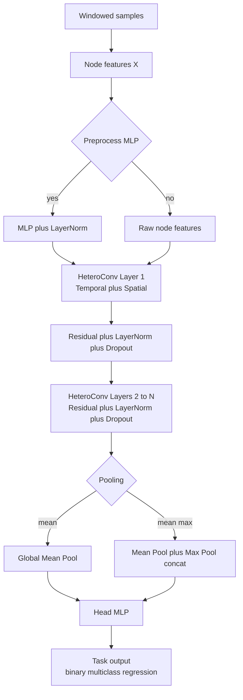
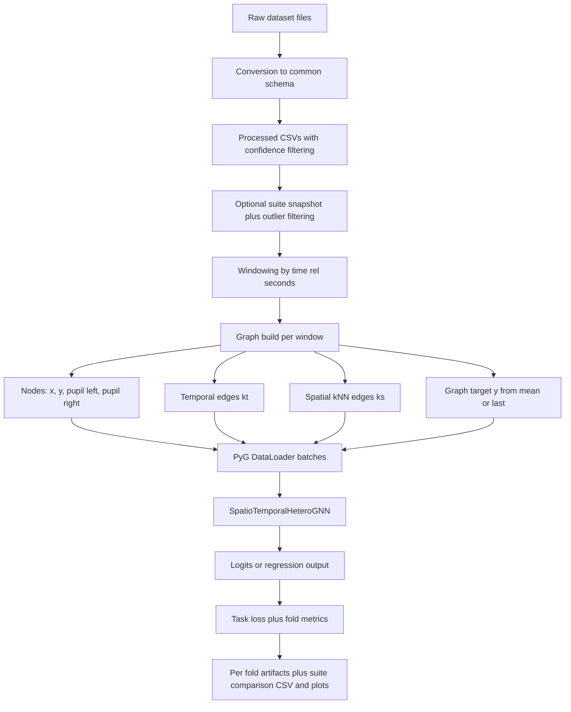
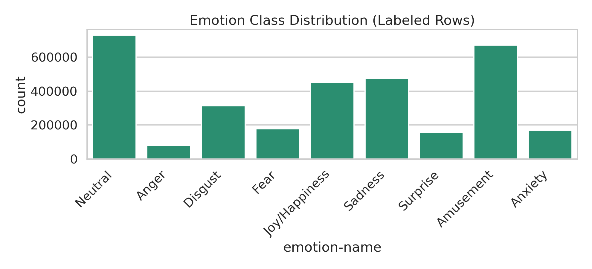
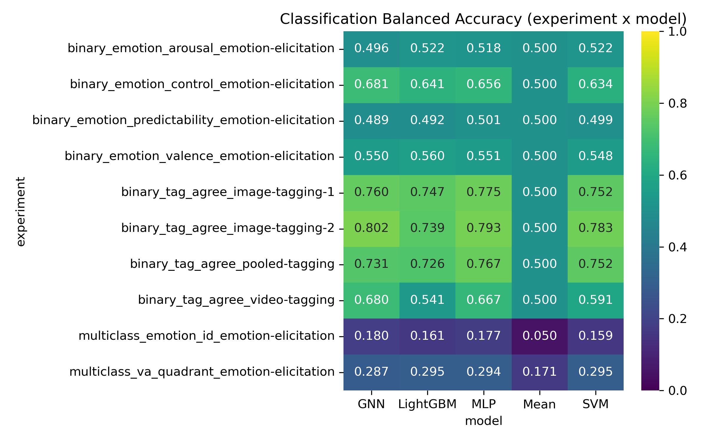
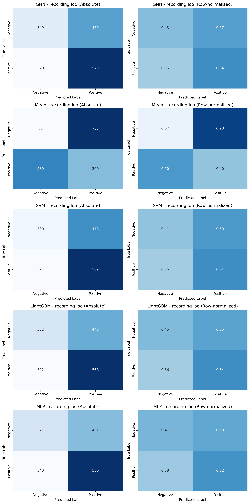

# GFM-for-eyetracker

Graph Foundation Model (GFM) research codebase for eye-tracking signals, focused on inferring affective/psychological states with a spatio-temporal GNN and comparing against classical ML baselines.

## Quick Repo Guide

| Area | Purpose |
|---|---|
| `src/emotions/` | Main current pipeline (binary/multiclass/regression, GNN + baselines) |
| `src/data/` | Data conversion, preprocessing, graph dataset construction |
| `src/emotions/suite/` | Wrapper that runs multi-experiment suites + EDA + comparisons |
| `src/emotions/gnn_improvement_experiments/` | Focused GNN ablation runner |
| `results/` | Experiment outputs (metrics, plots, summaries) |
| `docs/journal.md` | Research history and decisions |

## Current Status (one-screen summary)

- Primary architecture: **SpatioTemporalHeteroGNN** in `src/emotions/model.py` (with residuals, LayerNorm, GELU, optional edge weights, configurable depth/pooling).
- Primary dataset now: **MAHNOB-HCI-TAGGING (emotion-elicitation scope)**.
- Historical dataset: **eSEEd_v2** (important for understanding what failed and why).
- Main benchmark run to reference: `results/suite/RETAIN_2026-03-05_13-04-55` (complete suite run).
- Key recent ablation finding (valence/arousal ablation subset): depth/early stopping had the largest deltas; `kt/ks`, edge weights, and target aggregation were small in that tested setup.

---

## 1. GNN Architecture and Training

### 1.1 Architecture (current main)

Implemented in `src/emotions/model.py` and wrapped by:
- `src/emotions/binary/model_binary.py`
- `src/emotions/multiclass/model_multiclass.py`
- `src/emotions/regression/train_regression.py` (uses base model directly)

Core blocks:

| Stage | What it does |
|---|---|
| Input node features | 4 features per node: `x-avg`, `y-avg`, `pupil-size-left-avg`, `pupil-size-right-avg` |
| Optional preprocess MLP | `Linear -> GELU -> LayerNorm -> Dropout -> Linear -> LayerNorm` |
| Message passing (N layers) | Heterogeneous conv over two edge types: temporal + spatial (`GCNConv` or `GATConv`) |
| Residual + normalization | Residual connection each layer + `LayerNorm` + dropout |
| Graph pooling | `mean` or `mean_max` pooling |
| Head MLP | Graph-level prediction head |

### 1.2 Graph construction idea

- Node = one time sample in a window.
- Temporal edges connect nearby timesteps (radius `kt`).
- Spatial edges connect `ks` nearest neighbors in `(x, y)` gaze space.
- Optional edge weight on both edge types: `w = exp(-|Δt|/tau)`.

### 1.3 Training logic

Task-specific training scripts:
- Binary: `src/emotions/binary/train_binary.py`
- Multiclass: `src/emotions/multiclass/train_multiclass.py`
- Regression: `src/emotions/regression/train_regression.py`

Losses:
- Binary: `BCEWithLogits` (logits -> sigmoid for metrics)
- Multiclass: Cross entropy
- Regression: MSE

Cross-validation options (shared splitter system):
- `subject_loo`
- `recording_loo`
- `combined_loo`
- `recording_kfold`

Model selection:
- Best checkpoint by validation loss per fold.

### 1.4 Architecture schema

---

## 2. Data: Shapes and Processing

## 2.0 Data sources you currently use

| Dataset | File(s) | Rows | Columns | Subjects | Recordings |
|---|---|---:|---:|---:|---:|
| HCI cached (emotion) | `data/processed/cached_hci_tagging_emotion.csv` | 3,797,165 | 22 | 24 | 24 media files |
| HCI subset | `data/processed/cached_hci_tagging_emotion_subset_100K.csv` | 100,000 | 22 | 1 | 16 |
| eSEEd cached | `data/processed/cached_eseed_dataset.csv` | 3,423,045 | 13 | 48 | 10 |

Note: `src/data/data_preprocess.py` currently rebuilds a `_subset_10K.csv` cache file; the checked-in subset file in `data/processed/` is `_subset_100K.csv`.

### 2.1 For GNN

Pipeline (actual implementation path):
1. Raw conversion to common schema (`src/data/data_conversion/*`).
2. Processed CSV generation + confidence-based filtering (`src/data/data_preprocess.py`).
3. Optional suite snapshot creation with quantile outlier filter (1%-99%) (`src/emotions/suite/data_snapshot.py`).
4. Windowing by `time-rel-seconds` (`window_length`, `window_overlap`).
5. Build `HeteroData` graphs (`src/data/data.py`):
   - `data['node'].x`: node features
   - `('node','temporal','node').edge_index`
   - `('node','spatial','node').edge_index`
   - optional `edge_attr` weights
   - graph-level target `data.y`

Example window/graph scale (10s windows, `kt=2`, `ks=2`):

| Snapshot | Total windows | Nodes/window (p50) | Temporal edges/window (p50) | Spatial edges/window (p50) |
|---|---:|---:|---:|---:|
| HCI suite snapshot (`binary_emotion_valence_emotion-elicitation`) | 1,698 | 585 | 2,334 | 1,602 |
| eSEEd cached (cleaned for core features) | 3,601 | 1,002 | 4,002 | 2,686 |

Training-ready HCI scale in full cache (emotion-elicitation, `emotion-derivation-status=ok`, core feature dropna, 10s windows):
- rows: 3,018,447
- windows: 5,551
- nodes/window p50: 601

### 2.2 For other models (baselines)

Baselines use aligned windows, but convert each window into aggregated tabular features (`src/emotions/train_baseline.py`):

Per-window features typically include:
- `x-avg_mean/std/min/max`
- `y-avg_mean/std/min/max`
- `pupil-size-left-avg_mean/std`
- `pupil-size-right-avg_mean/std`
- optional confidence means

Targets per window:
- `mean` or `last` target aggregation (configurable, aligned with GNN).

Binary labels:
- Built from continuous targets with fold-specific threshold (`mean`, `median`, or fixed numeric), computed on train split only.

---

## 3. Other Models You Train and How

### 3.1 Main model zoo in `src/emotions/`

| Task | GNN | Baselines |
|---|---|---|
| Binary classification | `BinarySpatioTemporalGNN` | Mean, SVM (RBF), LightGBM, MLP |
| Multiclass classification | `MulticlassSpatioTemporalGNN` | Mean, SVM, LightGBM, MLP |
| Single-target regression | `SpatioTemporalHeteroGNN` | Mean, SVR, LightGBM regressor, MLP regressor |

### 3.2 Historical predecessor model

- `src/gnext/`: GraphSAGE next-point gaze prediction prototype (early project phase, predecessor to current emotion inference stack).

---

## 4. Experiments and History: What Worked, What Did Not

Primary narrative source: `docs/journal.md` + `results/*`.

### 4.1 High-level timeline

| Period | What was tried | Outcome |
|---|---|---|
| Early | Next-point prediction (`gnext`) | Captured trends; moved to downstream affect tasks |
| eSEEd_v2 regression | Multi-target emotion regression with LOO splits | GNN partially competitive but unstable; limited generalization |
| eSEEd_v2 binary + cleaning | Binary tasks + data cleaning + collapse debugging | Major GNN collapse issues identified |
| Transition to HCI | EDA + binary valence/arousal/control/predictability | Cleaner data, non-collapsed GNN behavior |
| HCI suite | Full binary/multiclass/regression suite | Binary competitive on some tasks; multiclass and regression weak |
| GNN ablations | Focused one-factor-at-a-time variants | Depth/early stopping most impactful in tested regime |

### 4.2 What changed performance (from ablation summary)

Source: `results/gnn_improvement_experiments/gnn_improvement_summary.md`

| Finding | Signal |
|---|---|
| `num_layers=10` improved valence best | +4.35 pp balanced accuracy vs baseline variant |
| Early stopping improved arousal best | +2.01 pp on arousal but reduced valence |
| `kt/ks` changes | Small effect in tested setup |
| Edge weights on/off | Near no-change in tested setup |
| `target_aggregation` mean vs last | Near no-change in tested setup |
| Too deep can hurt | e.g., 5 layers degraded strongly on valence |

### 4.3 Main benchmark suite snapshot (complete run)

Reference: `results/suite/RETAIN_2026-03-05_13-04-55`

- Best GNN binary emotion task: **emotion-control** (`balanced_accuracy=0.6813`).
- In this run, GNN won emotion-control, while LightGBM/MLP were better on several other emotion tasks.
- Multiclass still weak (emotion-id and VA quadrant).
- Regression remained weak (best non-Mean CCC in this run: `0.0932`).

### 4.4 Important known issue

- Later “optimal config” run (`results/suite/RETAIN_2026-03-05_16-11-26`) is **partial/incomplete** due to fold-mapping failure (`IndexError`) when transitioning to `subject_loo`. Use the 13:04:55 suite as main complete benchmark.

---

## 5. Detailed GNN Data Flow

Shape trace (typical binary HCI window):
- Input window: 585 rows (p50 in referenced snapshot)
- Node matrix: `X in R^(585 x 4)`
- Temporal edges (directed): 2,334
- Spatial edges (directed, deduped): 1,602
- Output per graph: 
  - binary: scalar logit
  - multiclass: class logits vector
  - regression: scalar value

---

## 6. How the GNN Works

### 6.1 Mathematical view

For each layer `l` and node `i`, relation-specific message passing is done on temporal and spatial graphs:

- Temporal message: aggregate neighbors in temporal edge set.
- Spatial message: aggregate neighbors in spatial edge set.
- Relation outputs are combined by hetero aggregation (`mean`/`sum`/etc., config).

With residual and normalization (simplified):

- `h_i^(l,raw) = GELU( Agg_rel(Conv_rel(h^(l-1), E_rel, w_rel)) )`
- `h_i^(l) = LayerNorm( h_i^(l,raw) + Residual(h_i^(l-1)) )`
- dropout applied after.

Graph embedding:
- `z_g = MeanPool(H_g)` or `z_g = [MeanPool(H_g) || MaxPool(H_g)]`

Head:
- `y_hat = output_scale * MLP(z_g)`

Loss by task:
- Binary: `BCEWithLogits(y_hat, y)`
- Multiclass: `CrossEntropy(y_hat, y)`
- Regression: `MSE(y_hat, y)`

### 6.2 Simple intuition

- Each node is a short eye-tracking moment.
- Temporal edges capture how gaze evolves in time.
- Spatial edges capture similarity in where gaze landed on screen.
- The GNN repeatedly mixes these two views, then summarizes the whole window into one representation and predicts state label/value.

---

## Key Visuals (for presentation)

### Dataset-level EDA example

### Suite-level classification overview

### Binary confusion matrices example

### Ablation heatmap example

---

## Deep-Dive Appendices

- [GNN Architecture and Training](docs/appendix/gnn_architecture_and_training.md)
- [Data Pipelines for GNN and Baselines](docs/appendix/data_pipelines_gnn_vs_baselines.md)
- [Model Zoo and Training Recipes](docs/appendix/model_zoo_and_training_recipes.md)
- [Experiment History and Findings](docs/appendix/experiment_history_and_findings.md)
- [GNN Math Explained](docs/appendix/gnn_math_explained.md)

---

## Prompt Packs for Presentation/Brainstorming

See `docs/prompts/` for reusable prompt templates:
- `prompt_gnn_high_level_overview_image.md`
- `prompt_gnn_detailed_dataflow_schema.md`
- `prompt_ablation_results_visual_story.md`
- `prompt_presentation_slide_outline.md`
