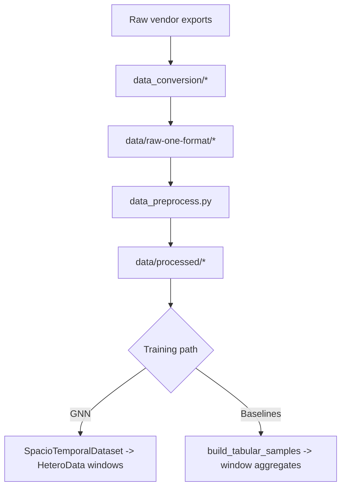

# Data Pipelines for GNN vs Baselines

This appendix documents how data moves from raw eye-tracker files to model-ready inputs for both graph and non-graph models.

## 1. End-to-end lineage

## 2. Conversion stage

## 2.1 HCI tagging conversion

File: `src/data/data_conversion/hci_tagging_conversion.py`

- Reads TSV + `session.xml` metadata.
- Uses mapping spec: `specifications/hci_to_GFM_spec.yaml`.
- Builds canonical columns such as:
  - `time-rel-seconds`, `x-avg`, `y-avg`, pupil, confidences
  - `subject`, `recording`, `section`, `experiment-type`
  - labels: `emotion-*` or `tag-*`

## 2.2 eSEEd conversion

File: `src/data/data_conversion/eSEED_v2_conversion.py`

- Maps merged CSV columns to GFM schema.
- Adds `time-rel-seconds` from absolute time.
- Adds `subject` and `recording` from filename.

## 3. Preprocessing stage

File: `src/data/data_preprocess.py`

Main processing rules:

1. Keep mandatory signal/confidence columns.
2. Mark low-confidence signal rows as NaN (`confidence-gaze-left/right` rule).
3. Trim each file to first/last valid-confidence indices.
4. Re-anchor time to start at zero.
5. Interpolate numeric non-protected columns (`limit=10`), plus short rolling smooth on pupil columns.
6. For HCI emotion scope, rebuild merged cache:
   - `data/processed/cached_hci_tagging_emotion.csv`
   - subset cache file

## 4. Current datasets and shapes

## 4.1 Cached files used in current work

| Dataset | File | Rows | Cols | Subjects | Recordings |
|---|---|---:|---:|---:|---:|
| HCI emotion cache | `data/processed/cached_hci_tagging_emotion.csv` | 3,797,165 | 22 | 24 | 24 |
| eSEEd cache | `data/processed/cached_eseed_dataset.csv` | 3,423,045 | 13 | 48 | 10 |

HCI cache columns (22):
- time/signal: `time-rel-seconds`, `x-avg`, `y-avg`, confidences, pupil L/R
- metadata: `subject`, `recording`, `section`, `session-id`, `experiment-type`, `is-stimulus`
- validity: raw validity cols
- labels: `emotion-id`, `emotion-arousal`, `emotion-valence`, `emotion-control`, `emotion-predictability`, `emotion-source`, `emotion-derivation-status`

## 4.2 Snapshot used by main benchmark suite

Reference snapshot:
- `results/suite/RETAIN_2026-03-05_13-04-55/experiments/binary_emotion_valence_emotion-elicitation/snapshot.csv`

From `eda_summary.txt`:
- rows: 879,357
- cols: 22
- subjects: 7
- recordings: 20
- signal quantile filter dropped 57,647 rows

## 5. GNN data path

Files:
- graph building: `src/data/data.py`
- used by trainers: `src/emotions/{binary,multiclass,regression}/train_*.py`

## 5.1 Windowing

- Group by `(subject, recording)`.
- Generate time windows using:
  - `window_length` (default 10s)
  - `window_overlap` (default 0)
- Keep window only if size `>= max(kt, ks)+1` for graph viability.

## 5.2 Node features

Default 4 per node:
- `x-avg`
- `y-avg`
- `pupil-size-left-avg`
- `pupil-size-right-avg`

## 5.3 Edges

- Temporal edges:
  - connect offsets `[-kt..-1, 1..kt]` per node
  - directed edges
- Spatial edges:
  - kNN on `(x-avg, y-avg)` with `ks`
  - add bidirectional edges, then deduplicate
- Optional edge weights (both relations):
  - `w = exp(-abs(dt)/tau)`

## 5.4 Graph targets

From configured target columns:
- `target_aggregation = mean` or `last` over rows in window
- stored as graph-level `data.y`

## 5.5 Typical graph sizes (kt=2, ks=2, window=10s)

| Source | Windows | Nodes p50 | Temporal edges p50 | Spatial edges p50 |
|---|---:|---:|---:|---:|
| HCI suite snapshot (sampled windows) | 1,698 | 584 | 2,330 | 1,602 |
| eSEEd cache (sampled windows) | 3,601 | 1,001 | 3,998 | 2,683 |

## 6. Baseline data path

Files:
- tabular builder: `src/emotions/train_baseline.py`
- used by binary/multiclass/regression trainers

For each time window, baselines compute fixed-length aggregate features:

- Gaze stats for `x-avg` and `y-avg`:
  - mean/std/min/max
- Pupil stats:
  - mean/std for left and right
- Confidence means (if present)

Targets are window-level with the same aggregation mode (`mean`/`last`) used by GNN.

## 7. Key differences (GNN vs non-GNN inputs)

| Aspect | GNN | Baselines |
|---|---|---|
| Input granularity | Node sequence per window | Aggregated vector per window |
| Structure | Explicit temporal + spatial graph | No graph structure |
| Variable length | Yes (num nodes varies by window) | No (fixed tabular width) |
| Feature scaling | Optional node-wise StandardScaler | Optional feature-wise StandardScaler |
| Target generation | Graph-level `y` per window | Row in tabular label frame per window |

## 8. Leakage guards and comparability rules

Implemented in trainers:

- Thresholds for binary/VA split are computed on train split only.
- Feature scalers are fit on train split only.
- Split alignment checks enforce identical fold composition between GNN and baselines (binary script includes strict signature checks).
