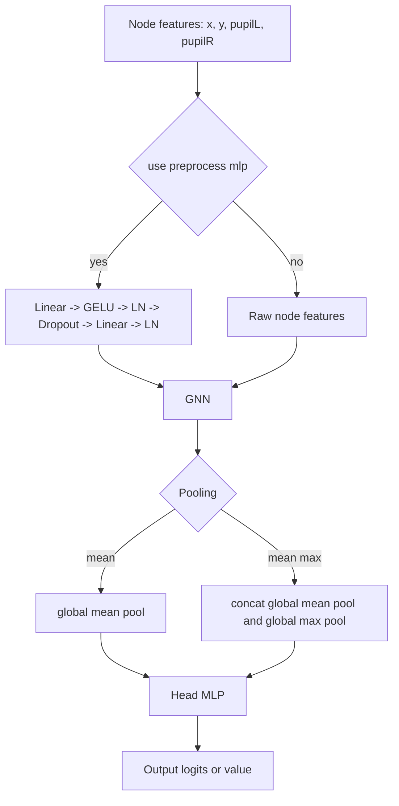
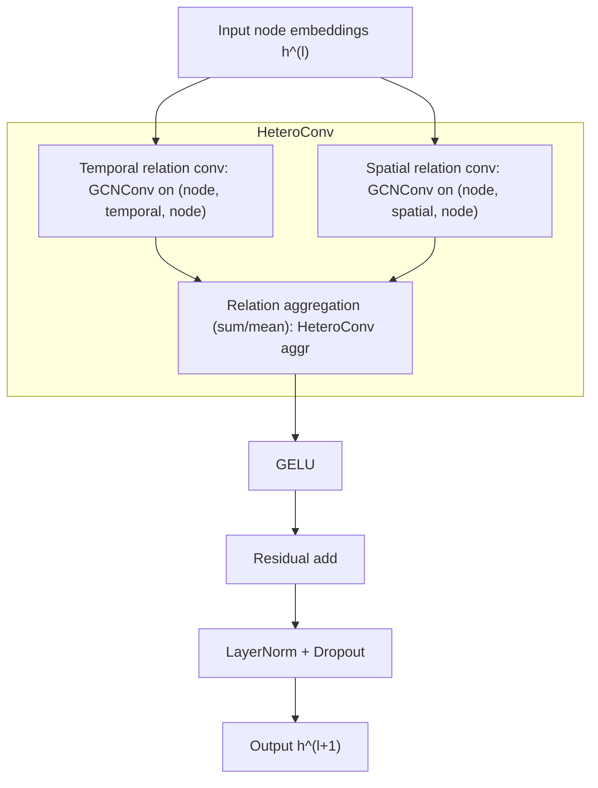

# GNN Architecture and Training (Detailed)

This appendix explains the current production GNN stack in `src/emotions/*` and how training is orchestrated.

## 1. Main GNN class

Primary model: `SpatioTemporalHeteroGNN` in `src/emotions/model.py`.

### 1.1 Forward graph

### 1.2 Per-layer internals

- Relation types:
  - `("node","temporal","node")`
  - `("node","spatial","node")`
- Convolution type is configurable:
  - `GCNConv`
  - `GATConv`
- Relation outputs are merged via `HeteroConv(..., aggr=<aggr>)`.
- Residual path:
  - layer 1 uses `input_residual_proj`
  - deeper layers use identity residual (`x_dict["node"]`)
- Norm/regularization:
  - `LayerNorm` after residual add
  - dropout after each layer

### 1.3 Unpacking one `GNN` block (default: `GCNConv`)

In this section, we assume the default convolution is `GCNConv` (this is the default in retained suite configurations).

Let $h_i^{(l)}$ be node $i$ features at layer $l$.  
For each relation $r \in \{\text{temporal}, \text{spatial}\}$, the `GCNConv` update is:

$$
m_i^{(r)} = \sum_{j \in \mathcal{N}_r(i) \cup \{i\}}
\frac{1}{\sqrt{\hat{d}_{i,r}\hat{d}_{j,r}}}\, W_r h_j^{(l)}
$$

Equivalently, the relation-local pre-activation output can be written as:

$$
h_{i,r}^{(l+1,\mathrm{pre})} =
\sum_{j \in \mathcal{N}_r(i) \cup \{i\}}
\frac{1}{\sqrt{\hat{d}_{i,r}\hat{d}_{j,r}}}\, W_r h_j^{(l)}
$$

where:
- $\mathcal{N}_r(i)$ is the neighbors of node $i$ under relation $r$
- $\hat{d}_{i,r}$ is the degree (including self-loop) under relation $r$
- $W_r$ is a learnable weight matrix for relation $r$

`HeteroConv` then aggregates relation-specific outputs:

$$
m_i = \mathrm{AGGR}\left(\left\{m_i^{(\text{temporal})},\, m_i^{(\text{spatial})}\right\}\right)
$$

with $\mathrm{AGGR}$ typically `sum` or `mean` in this project. The block output is:

$$
\tilde{h}_i^{(l+1)} = \mathrm{GELU}(m_i)
$$

$$
h_i^{(l+1)} = \mathrm{LayerNorm}\!\left(\tilde{h}_i^{(l+1)} + \mathrm{res}_i^{(l)}\right)
$$

followed by dropout, where:
- at layer 1, $\mathrm{res}_i^{(l)}$ comes from `input_residual_proj(h_i^{(l)})`
- at deeper layers, $\mathrm{res}_i^{(l)} = h_i^{(l)}$

### 1.4 If we switch to `GATConv` instead

The overall block structure is unchanged (same two relations, same `HeteroConv` aggregation, same residual/norm/dropout).  
What changes is the per-relation message function:

- `GCNConv`: fixed degree-based normalization weights
- `GATConv`: learned attention weights $\alpha_{ij}^{(r)}$ on edges (optionally multi-head), so relation updates become attention-weighted neighbor sums instead of degree-normalized sums

For `GATConv`, the relation-local pre-activation output is:

$$
h_{i,r}^{(l+1,\mathrm{pre})} =
\sum_{j \in \mathcal{N}_r(i) \cup \{i\}}
\alpha_{ij}^{(r)}\, W_r h_j^{(l)}
$$

with $\sum_{j \in \mathcal{N}_r(i) \cup \{i\}} \alpha_{ij}^{(r)} = 1$ for each target node $i$ (per attention head).

In short, `HeteroConv` still merges temporal and spatial relation outputs in the same way; only the relation-local operator changes from normalized graph convolution (`GCNConv`) to attention-based graph convolution (`GATConv`).

## 2. Task-specific wrappers

- Binary classification: `src/emotions/binary/model_binary.py`
  - `out_channels=1`, `output_scale=1.0`
  - trained with `BCEWithLogits`
- Multiclass classification: `src/emotions/multiclass/model_multiclass.py`
  - `out_channels=num_classes`, `output_scale=1.0`
  - trained with `CrossEntropy`
- Regression: direct `SpatioTemporalHeteroGNN` usage in `src/emotions/regression/train_regression.py`
  - `out_channels=1`
  - trained with `MSE`

## 3. Graph input expected by the model

Built by `SpacioTemporalDataset` (`src/data/data.py`) as `HeteroData` with:

- `data["node"].x`: `[num_nodes, in_channels]`
- `data[("node","temporal","node")].edge_index`: `[2, E_t]`
- `data[("node","spatial","node")].edge_index`: `[2, E_s]`
- optional `edge_attr` for both relations when `use_edge_weights=true`
- `data.y`: graph-level target (scalar or vector)

## 4. Training loop behavior (important details)

## 4.1 Binary (`src/emotions/binary/train_binary.py`)

- Per fold:
  - compute threshold from **train split only** (`mean`/`median`/fixed)
  - binarize targets: `y=1 if target > threshold else 0`
- Standardization (optional):
  - graph node features and baseline tabular features both scaled from train split
- Split alignment safety:
  - baseline and GNN fold identities/signatures are compared
  - run aborts if splits differ (prevents unfair comparisons)
- Model selection:
  - best checkpoint by validation loss
  - optional early stopping controls available

## 4.2 Multiclass (`src/emotions/multiclass/train_multiclass.py`)

Two modes:
- `emotion-id`
- `va-quadrant` (threshold valence/arousal to LL/LH/HL/HH; thresholds from train fold)

Per fold:
- build class mapping (`raw_label -> encoded_index`)
- convert graph/tabular labels with identical fold context
- train GNN and baselines with same split strategy

## 4.3 Regression (`src/emotions/regression/train_regression.py`)

- Single-target regression (`target_column`)
- Same split/standardization design as above
- GNN trained via MSE; baselines via sklearn/lightgbm wrappers

## 5. Default/typical configuration knobs

| Group | Typical value (HCI configs) | Where |
|---|---|---|
| `window_length` | `10` sec | `dataset.*` YAML |
| `window_overlap` | `0` | `dataset.*` YAML |
| `kt`,`ks` | `2`,`2` | `dataset.*` YAML |
| `feature_columns` | `x-avg,y-avg,pupil-size-left-avg,pupil-size-right-avg` | `dataset.*` YAML |
| `hidden_channels` | `128` | `gnn.model` |
| `num_layers` | run-configured (e.g., `2` in retained suite configs, `10` in ablation variants) | `gnn.model` |
| `pooling` | `mean` or `mean_max` | `gnn.model` |
| `conv_type` | `GCNConv` in retained suite configs; `GATConv` also supported and tested | `gnn.model` |
| `batch_size` | `64` | `gnn.training` |
| `lr` | `1e-3` | `gnn.training` |

## 6. Historical predecessor (kept for continuity)

`archive/src/gnext/*` is the predecessor stack:
- task was next-point gaze prediction
- primary model: `NextPointGNN` (GraphSAGE)
- this is historical context, not the current emotion benchmark pipeline

## 7. Why this architecture fits your data

- Temporal relation captures motion continuity.
- Spatial relation captures gaze-position similarity (screen-space neighborhoods).
- Window-level graph prediction matches your label granularity (emotion/tag values per segment).
- Shared backbone across binary/multiclass/regression lets you compare tasks under a common representation.
