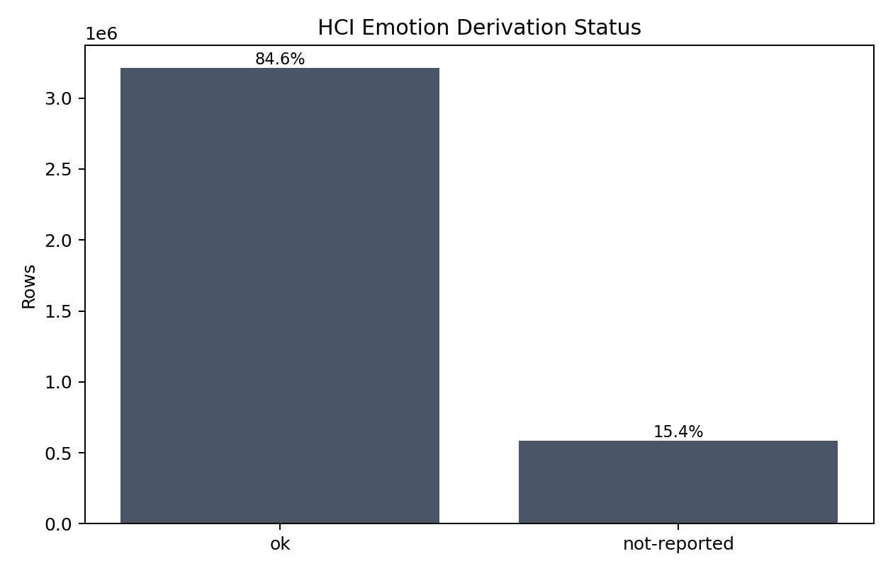
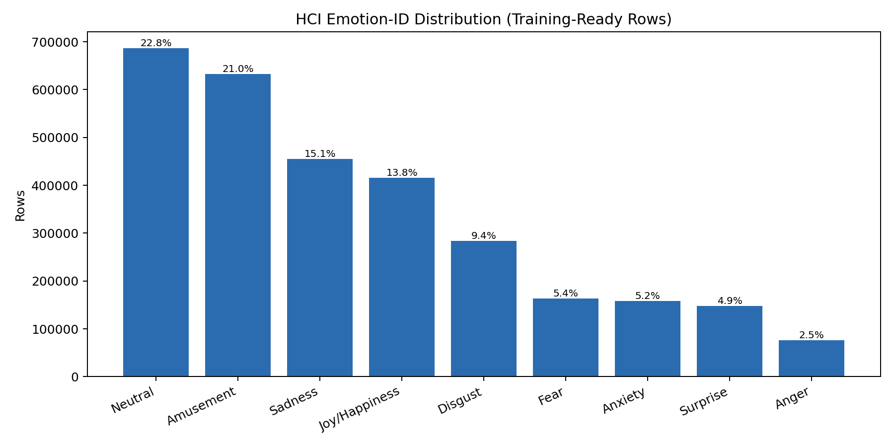
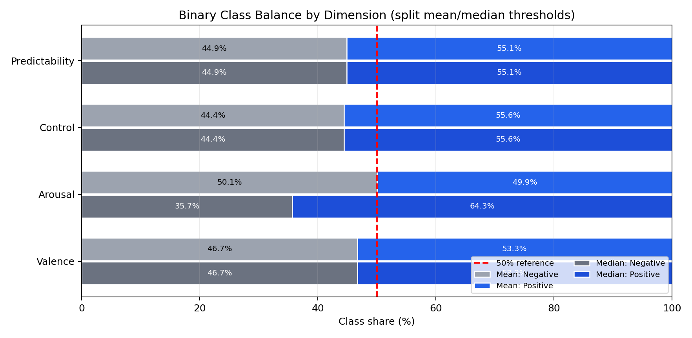
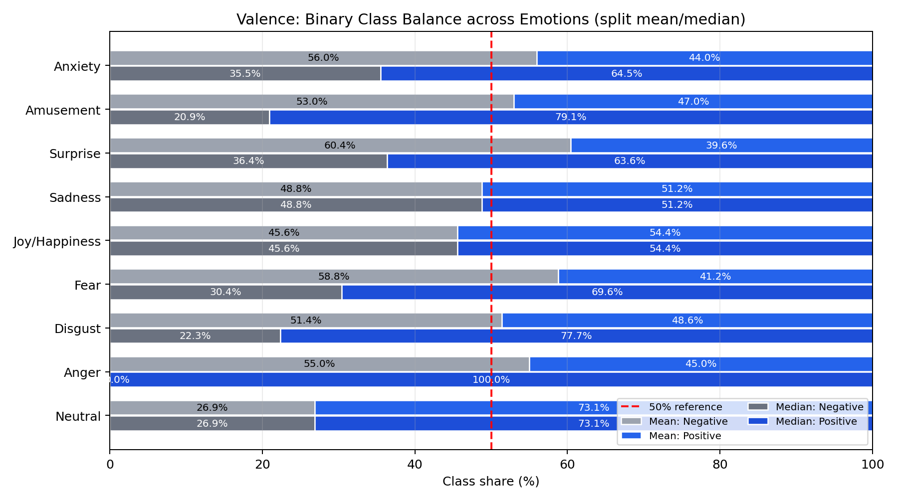
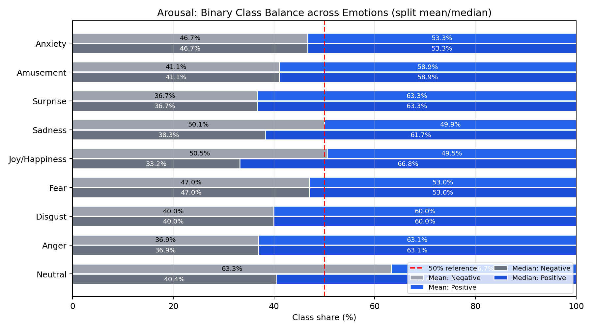
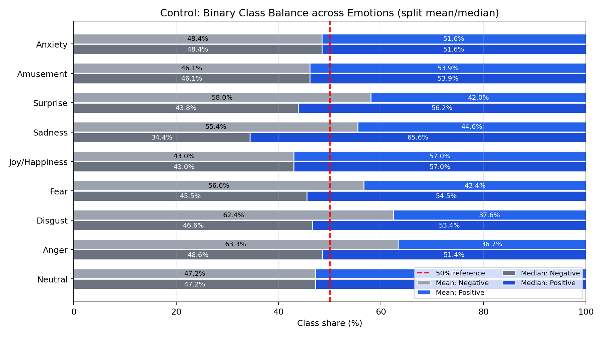
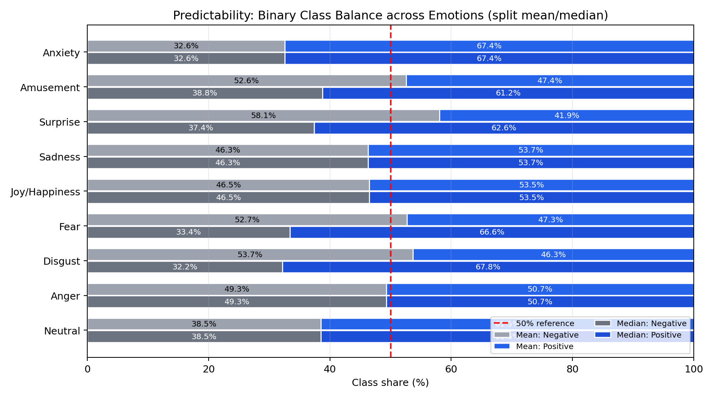
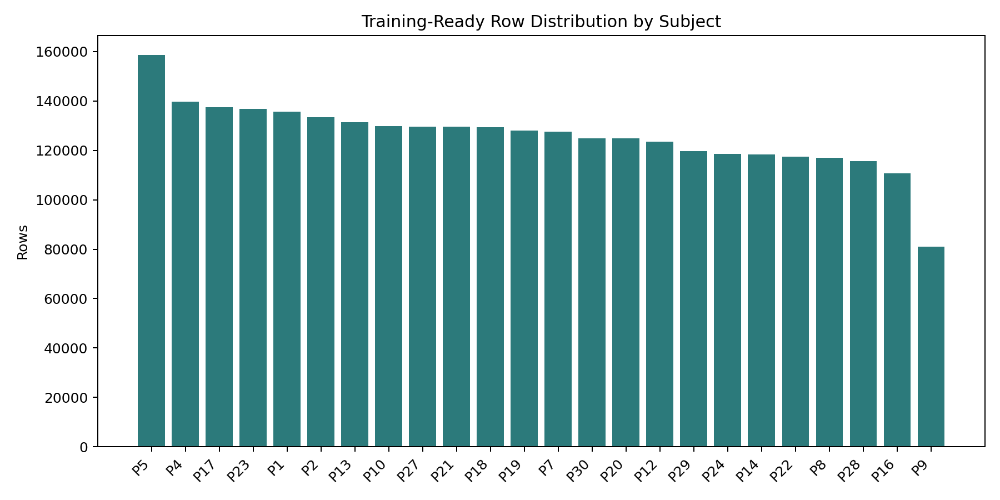

# HCI-Tagging Dataset Description

## Thorough Description

### Scope and what we currently train on
- This repository currently uses **MAHNOB-HCI-TAGGING emotion-elicitation data** from `data/processed/cached_hci_tagging_emotion.csv`.
- Experiment-type counts in this cache: `emotion-elicitation`: 3,797,165.
- Training in current emotion pipelines further filters rows to label-quality `ok` and drops rows with missing core gaze/pupil signals.

### Core dataset snapshot

| Metric | Value |
|---|---:|
| Total rows | 3,797,165 |
| Subjects | 24 |
| Recordings | 24 |
| Sections | 40 |
| Training-ready rows (`status=ok` + core signals non-null) | 3,018,447 |
| Training-ready subjects | 24 |
| Training-ready recordings | 20 |

### Label quality status

| Label status | Rows | Share |
|---|---:|---:|
| ok | 3,214,000 | 84.64% |
| not-reported | 583,165 | 15.36% |

### Emotion labels (multiclass target: `emotion-id`)

| Emotion ID | Emotion | Rows | Share |
|---:|---|---:|---:|
| 0 | Neutral | 687,001 | 22.76% |
| 1 | Anger | 75,833 | 2.51% |
| 2 | Disgust | 283,588 | 9.40% |
| 3 | Fear | 163,299 | 5.41% |
| 4 | Joy/Happiness | 415,249 | 13.76% |
| 5 | Sadness | 455,271 | 15.08% |
| 6 | Surprise | 147,548 | 4.89% |
| 11 | Amusement | 632,392 | 20.95% |
| 12 | Anxiety | 158,266 | 5.24% |

### How labels are assigned in HCI emotion-elicitation
- `emotion-id` is a categorical felt-emotion label (observed IDs in this cache: `0, 1, 2, 3, 4, 5, 6, 11, 12`).
- `emotion-valence`, `emotion-arousal`, `emotion-control`, and `emotion-predictability` are integer ratings on a **1-9** scale.
- In this processed cache, labels are effectively **one set per (subject, recording) trial** and repeated across all time rows for that trial.
- Verified on `emotion-derivation-status = ok`: for every `(subject, recording)` group, each emotion label column has exactly one unique value.
- Label source in conversion: first from `session.xml` (`feltEmo`, `feltArsl`, `feltVlnc`, `feltCtrl`, `feltPred`), with Guide-Cut fallback when needed.

### Continuous emotion dimensions used in binary/regression tasks
- Available dimensions: `emotion-valence`, `emotion-arousal`, `emotion-control`, `emotion-predictability`.
- In binary experiments, thresholds are computed from train split (default config uses `mean`).
- Overall class balance with **global mean threshold** (reference only):

| Dimension | Mean Threshold | Negative | Positive | Positive Rate |
|---|---:|---:|---:|---:|
| Valence | 4.5868 | 1,408,686 | 1,609,761 | 53.33% |
| Arousal | 4.5057 | 1,511,814 | 1,506,633 | 49.91% |
| Control | 4.8779 | 1,341,526 | 1,676,921 | 55.56% |
| Predictability | 5.7000 | 1,355,879 | 1,662,568 | 55.08% |

- Overall class balance with **global median threshold** (reference only):

| Dimension | Median Threshold | Negative | Positive | Positive Rate |
|---|---:|---:|---:|---:|
| Valence | 5.0000 | 1,408,686 | 1,609,761 | 53.33% |
| Arousal | 4.0000 | 1,077,332 | 1,941,115 | 64.31% |
| Control | 5.0000 | 1,341,526 | 1,676,921 | 55.56% |
| Predictability | 6.0000 | 1,355,879 | 1,662,568 | 55.08% |

- Combined view (upper half = mean-threshold split, lower half = median-threshold split):

### Per-dimension binary class balance across emotions (mean vs median thresholds)
- In each plot, rows are **emotions**.
- For each emotion row: **upper half = mean-threshold split**, **lower half = median-threshold split**.

#### Valence

#### Arousal

#### Control

#### Predictability

### Rough distribution characteristics
- Subject row count spread (training-ready): min **80,991**, median **127,733**, max **158,649**.
- Recording row count spread (training-ready): min **87,756**, median **154,330**, max **214,732**.
- Recordings with no remaining training-ready rows after filters: `colorbars_Final.avi`, `seagulls_Final.avi`, `sticks_Final.avi`, `waves_Final.avi`.

### Preprocessing pipeline in this repo
1. Keep mandatory time/signal/confidence columns plus metadata/labels.
2. For HCI rows, confidence gate requires both `confidence-gaze-left == 1` and `confidence-gaze-right == 1`.
3. Rows outside confidence gate have non-protected signal columns set to NaN.
4. Trim each file to first/last valid-confidence index and re-anchor `time-rel-seconds` to start at zero.
5. Interpolate numeric non-protected columns (linear, bounded gap), and smooth pupil channels with short rolling mean.
6. Rebuild merged cache (`cached_hci_tagging_emotion.csv`).

### How rows become GNN graphs during training
1. Apply dataset filters (`allowed_experiment_types`, label quality, `dropna_columns`, optional subject/recording filters).
2. Group by `(subject, recording)` and create fixed-time windows (default: **10 s**, overlap **0**).
3. Keep windows with at least `max(kt, ks) + 1` samples (default min 3).
4. Build one hetero-graph per window with node features (`x-avg`, `y-avg`, `pupil-size-left-avg`, `pupil-size-right-avg`), temporal edges (`kt=2`), and spatial kNN edges (`ks=2`).
5. Graph target is aggregated per window (`mean` or `last`; current configs use `mean`).

### Window-level scale (training-ready, 10s windows)
- Non-empty windows: **5,553**
- GNN-usable windows (>=3 nodes): **5,551**
- Nodes per usable window: p25 **550**, p50 **600**, p75 **601**, mean **543.77**

## Slide Bulletpoints (Max 8)
- We use **MAHNOB-HCI-TAGGING (emotion-elicitation)** as our primary dataset in this repo.
- Current cache has **3.80M rows**, **24 subjects**, **24 recordings**; after training filters we keep **3.02M rows**.
- Label quality is strong: **84.6% `ok`** and **15.4% `not-reported`**.
- Multiclass target is `emotion-id` with **9 observed classes**; largest are **Neutral (22.8%)** and **Amusement (21.0%)**.
- Class distribution is imbalanced (e.g., **Anger 2.5%** vs majority classes >20%).
- Continuous targets are **valence, arousal, control, predictability** (1-9 scale), used for binary/regression tasks.
- Preprocessing: confidence gating, trim to valid segment, time re-anchoring, interpolation, pupil smoothing.
- GNN pipeline: 10s windows -> hetero-graphs (temporal + spatial edges, `kt=2`, `ks=2`) -> graph-level target aggregation.
