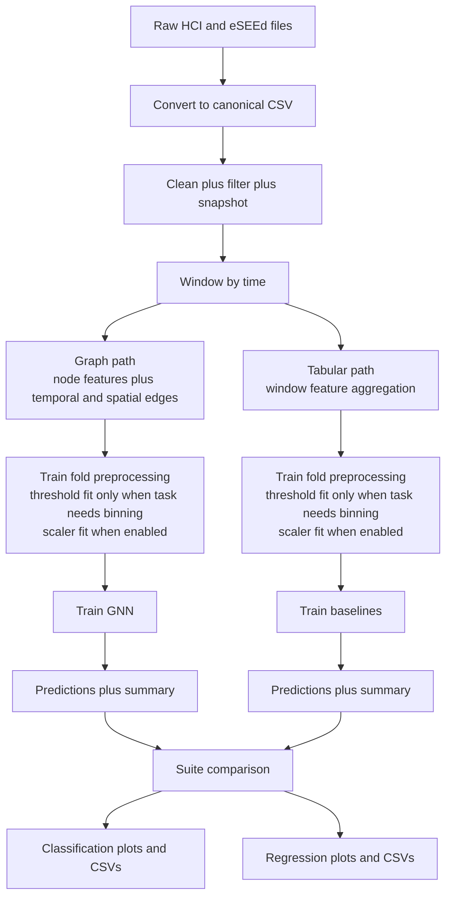

# Solution: GNN Detailed Dataflow Schema

## DETAILED_MERMAID

```mermaid
flowchart TB
    raw_hci["Raw HCI TSV and session XML"]
    raw_eseed["Raw eSEEd merged CSV"]

    subgraph conv["1. Conversion"]
        hci_conv["HCI conversion<br/>hci_tagging_conversion.py"]
        eseed_conv["eSEEd conversion<br/>eSEED_v2_conversion.py"]
        canonical["Canonical CSV tables"]
        raw_hci --> hci_conv --> canonical
        raw_eseed --> eseed_conv --> canonical
    end

    subgraph prep["2. Cleaning and dataset filters"]
        preprocess["Preprocess script<br/>data_preprocess.py"]
        snapshot["Snapshot script<br/>data_snapshot.py"]
        filters["Dataset filters: subject, recording, experiment type, label quality"]
        clean["Cleaning: confidence masking, trim valid region, re-anchor time, interpolate, dropna"]
        canonical --> preprocess --> snapshot --> filters --> clean
    end

    subgraph win["3. Windowing"]
        windows["Window slicing by time rel seconds\nwindow length plus window overlap\nmin samples per window guard"]
        clean --> windows
    end

    subgraph gnn["4A. GNN branch"]
        gds["Graph dataset builder<br/>SpacioTemporalDataset"]
        nodes["Nodes: time samples\nFeatures: x avg, y avg, pupil left and right"]
        et["Temporal edges: plus minus kt neighbors\nedge weights optional time gap decay"]
        es["Spatial edges: ks kNN in x and y\nedge weights optional time gap decay"]
        split_g["CV splits: subject loo, recording loo, combined loo, recording kfold"]
        fold_ops_g["Train fold only ops:\nthreshold fit only for binary or VA\nscaler fit when enabled"]
        train_g["Task trainers\ntrain_binary.py\ntrain_multiclass.py\ntrain_regression.py"]
        eval_g["Validation and test eval plus best checkpoint"]
        art_g["GNN artifacts:\nbest_model.pt, test_predictions.npy,\ntest_targets.npy, summary.csv"]

        gds --> nodes --> et --> es --> split_g --> fold_ops_g --> train_g --> eval_g --> art_g
    end

    subgraph tab["4B. Baseline tabular branch"]
        tbuild["Tabular builder\ntrain_baseline.py"]
        agg["Window aggregation:\ngaze mean, std, min, max\npupil mean and std\nconfidence means"]
        split_t["CV splits aligned to GNN strategy"]
        fold_ops_t["Train fold only ops:\nthreshold fit only for binary or VA\nscaler fit when enabled"]
        train_t["Baseline families:\nMean, SVM, LightGBM, MLP"]
        eval_t["Test eval plus per fold metrics"]
        art_t["Baseline artifacts:\nmodel.pkl, test_predictions.npy,\ntest_targets.npy, summary.csv"]

        tbuild --> agg --> split_t --> fold_ops_t --> train_t --> eval_t --> art_t
    end

    subgraph suite["5. Suite aggregation and plotting"]
        compare["Suite comparison script\ncompare_suite_results.py"]
        plots_cls["Classification suite outputs:\nclassification_master_comparison.csv\nclassification_heatmap_*.png\nclassification_group_model_ranking.png"]
        plots_reg["Regression outputs:\nregression_master_comparison.csv\nregression heatmaps"]

        art_g --> compare
        art_t --> compare
        compare --> plots_cls
        compare --> plots_reg
    end

    windows --> gds
    windows --> tbuild
```

## SIMPLIFIED_MERMAID

## STAGE_TABLE

| Stage | Input | Transform | Output |
|---|---|---|---|
| Conversion | Raw HCI/eSEEd exports | Map source-specific fields to canonical schema | Canonical CSV tables |
| Cleaning/filtering | Canonical CSV tables | Confidence masking, trimming, interpolation, dropna, cohort filters | Cleaned time-series rows |
| Windowing | Cleaned rows grouped by subject/recording | Time-based slicing with overlap and minimum-size guard | Window samples |
| GNN build | Window samples | Build heterogeneous graphs (node features + temporal/spatial edges) | `HeteroData` windows |
| Tabular build | Window samples | Aggregate each window into fixed-length statistics | Tabular windows |
| CV split | Graph/tabular windows | Group-aware split strategy (`subject_loo`, `recording_loo`, etc.) | Train/val/test folds |
| Fold-safe ops | Train fold only | Fit thresholds only when task needs label binning (`binary`, `va-quadrant`), and fit scalers only on train fold when enabled | Fold-specific transformed data |
| Training | Fold-specific data | Train task model(s) and keep best checkpoint | Trained model artifacts |
| Evaluation | Test fold predictions | Compute metrics and save fold summaries | `summary.csv`, predictions, targets |
| Suite aggregation | Per-experiment summaries | Cross-experiment comparison and plotting | Master CSVs + classification/regression plots |
