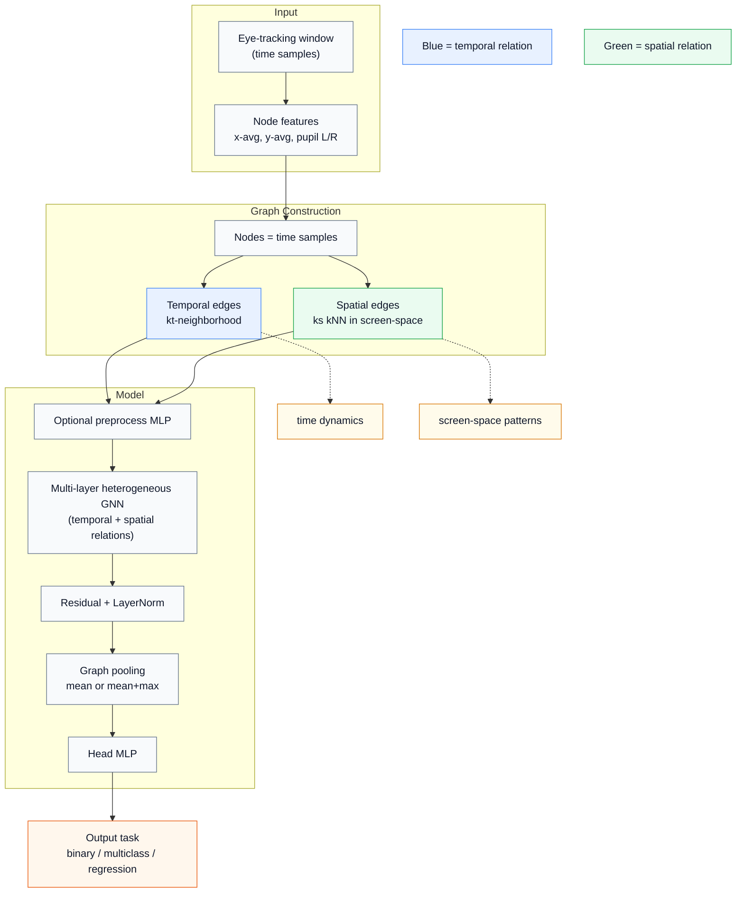
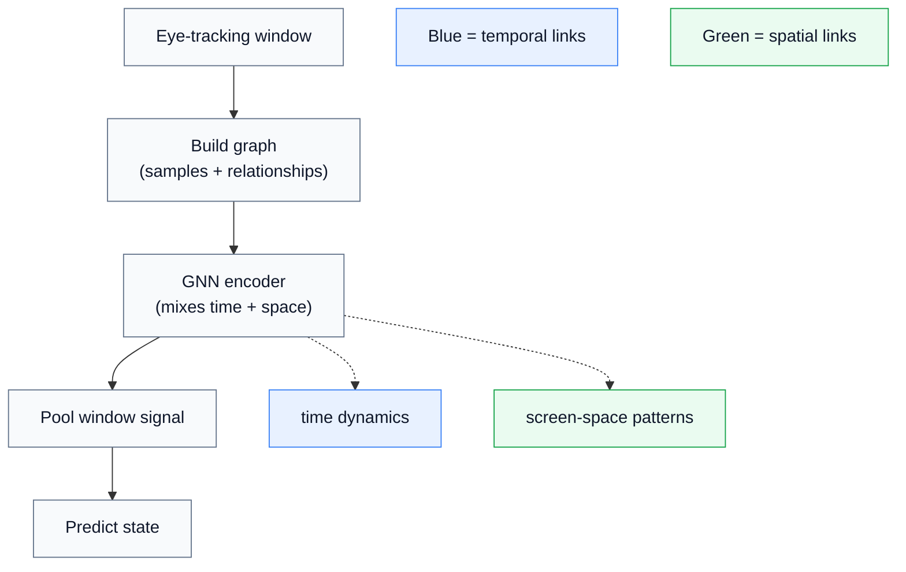

# Solution: GNN High-Level Overview Image

## VARIANT_A_TECHNICAL

## VARIANT_B_EXECUTIVE

## CAPTION_A
Each time window is converted into a graph whose nodes are time samples and whose edges encode temporal and spatial relationships. A heterogeneous GNN repeatedly mixes both relation types, then pools window information into one embedding for prediction. The same backbone supports binary, multiclass, and regression tasks.

## CAPTION_B
The model treats each short gaze segment as a connected structure, not just a flat feature vector. It combines how gaze changes over time with where gaze clusters on screen, then predicts the target state from the summarized window. This captures both motion and spatial behavior in one pipeline.
